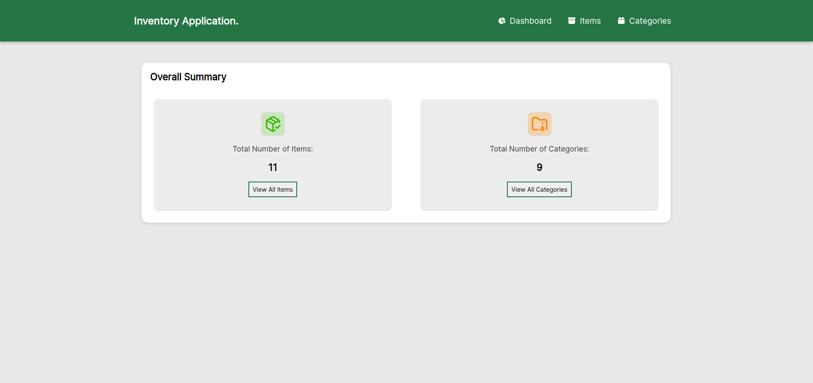
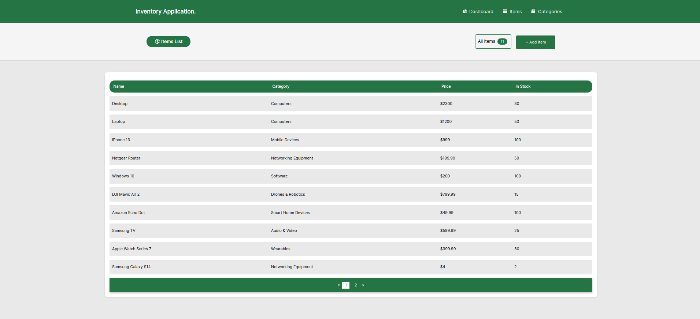
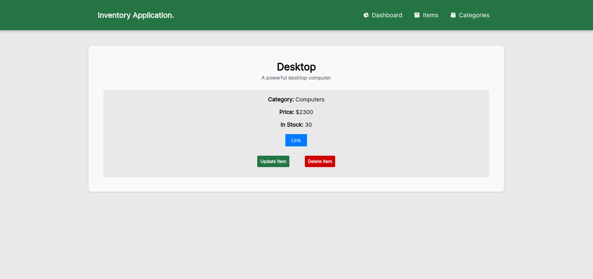
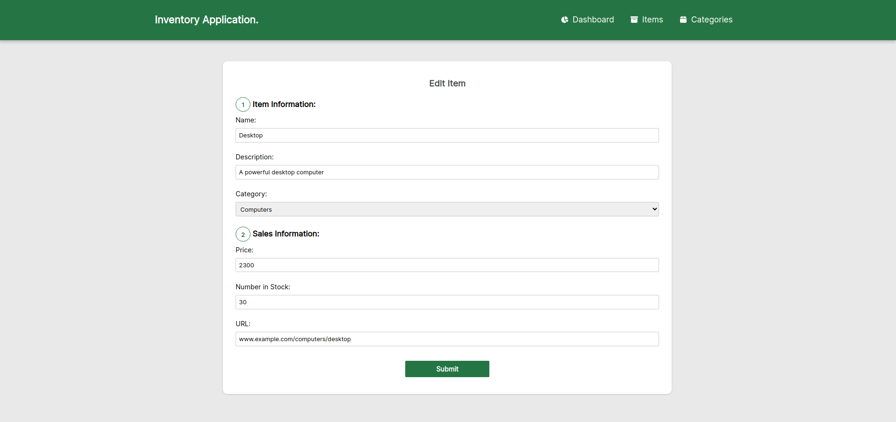
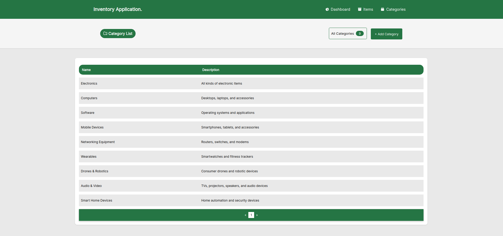
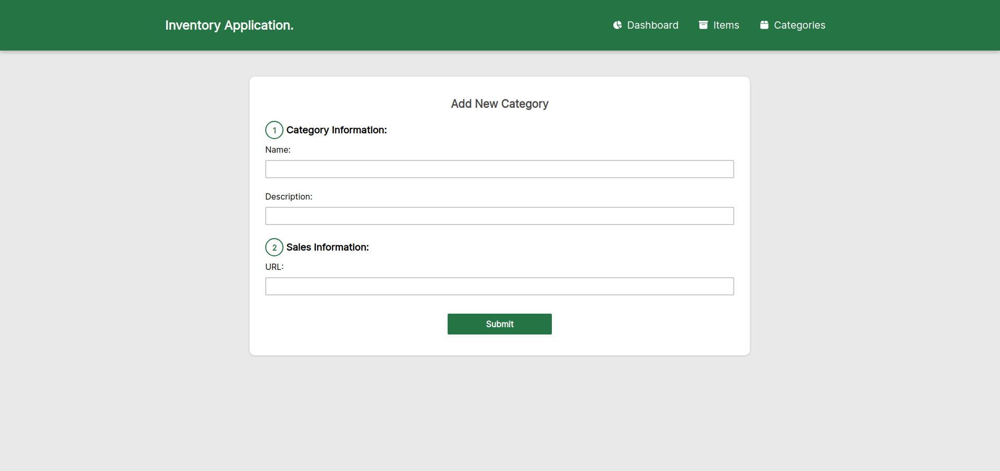
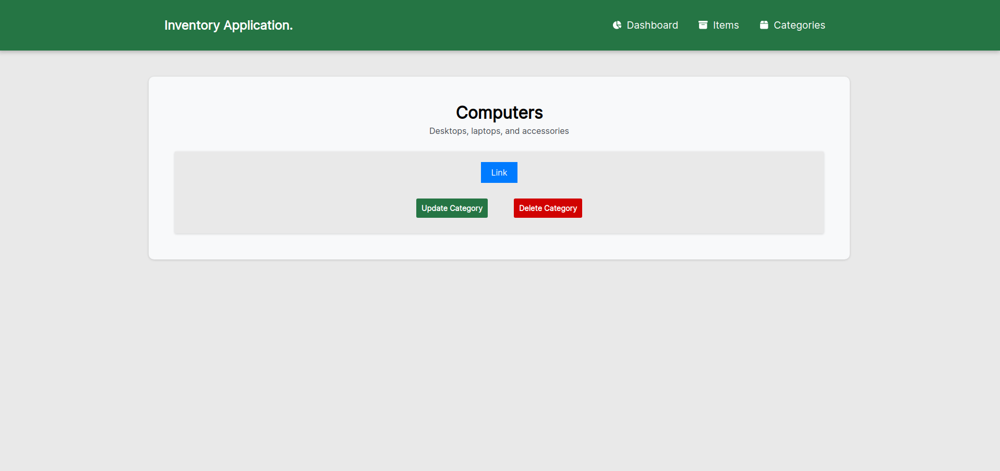
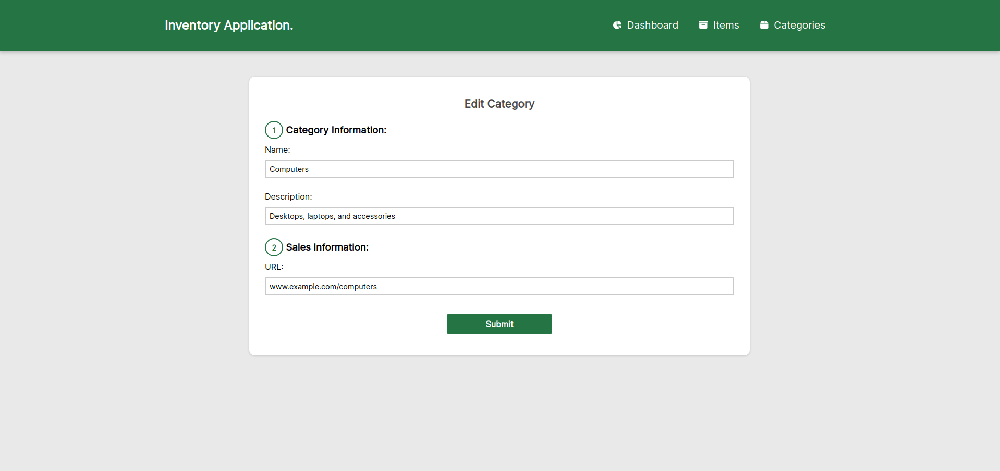

# Inventory App

🔗 [View Demo](https://inventory-app-3hvj.onrender.com)

## Table of Contents
- [About The Project](#about-the-project)
- [Built With](#built-with)
- [Screenshots](#screenshots)
- [Features](#features)

## About The Project
A Inventory Management application that includes categories and items.

## Screenshots

### Initial Screen
 

### Items Page
 

### Add Item

### Individual Items Page

### Update Item

### Categories Page

### Add Category

### Individual Categories Page

### Update Category

[Back to Top](#inventory-app)

## Built With
- HTML
- CSS
- JavaScript
- Webpack
- React
- Node
- Express
- MongoDB

[Back to Top](#inventory-app)

## Features

- Items & Categories Page
- Ability to Create, Read, Update and Delete any Item or Category (CRUD)
- Shows List of Every Item or Category
- Overally Summary Section
- Individual Page for Each Item or Category
- Implementation of Page Numbers for Filtering
- Responsive User Interface

[Back to Top](#inventory-app)

